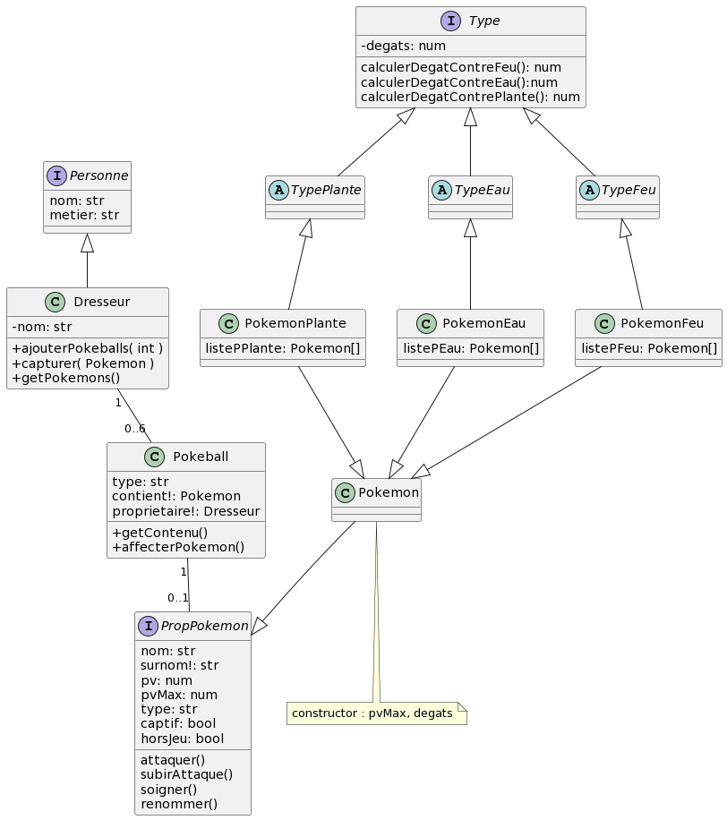

# Réponses aux questions

### Exercice 1

1. Le diagramme respecte-t-il le principe de responsabilité unique ?

> - Oui

2. Pourquoi ?

> - Le diagramme respecte le principe de responsabilité unique car chaque classe et interface
ont leur propre rôle dans le diagramme et ne prennent pas trop de responsabilité.
Ce qui permet une meilleure lisibilité du code et ainsi sa maintenabilité et une bonne compréhension générale du projet.

---

3. Le diagramme respecte-t-il le principe Open/Closed ?

> - Oui

4. Pourquoi ?

> - Le principe Open/Closed rentre en application dans ce diagramme car dans l'exemple du Type d'un pokemon,
on a une interface générale pour tous les types, des classes abstraites de chaque Type et chacun d'entre eux sont rattacher à des pokemons.
Ainsi oui et ce pour les autres classes et interfaces également, le code permet d'étendre plutôt qu'opter pour la modification.

---

5. Le diagramme respecte-t-il le principe de substitution de Liskov ?

> - Oui

6. Pourquoi ?

> - Le principe de substitution de Liskov signifie que l'on peut remplacer un type
par son sous-type sans modification du programme donc oui cela est possible dans notre diagramme car
nous n'avons pas obligation de vérifier sur chaque méthode des appartenances. 

---

7. Le diagramme respecte-t-il le principe de ségrégation des interfaces ?

> - Non

8. Pourquoi ?

> Nous utilisons une interface de Type et de Pokemon unique.
> - Pour les types
: nous avons plusieurs types existants.
> - De même pour ces pokemon qui ont pour chacun une interface Pokemon unique.

---

9. Le diagramme respecte-t-il le principe d'inversion des dépendences ?

> - Non

10. Pourquoi ?

> - Les classes dépendent des abstractions pour les différents pokémons mais ce
n'est pas le cas concernant le Dresseur en haut de sa généalogie qui n'a pas sa propre interface ou classe abstraite.

---

11. Proposez un diagramme alternatif

> #### Deux points importants
> 
> Un pokemon précis ne devrait pas avoir de classe et devrait étre regroupé en classe selon les types.
> 
> Le dresseur devrait avoir son interface.

